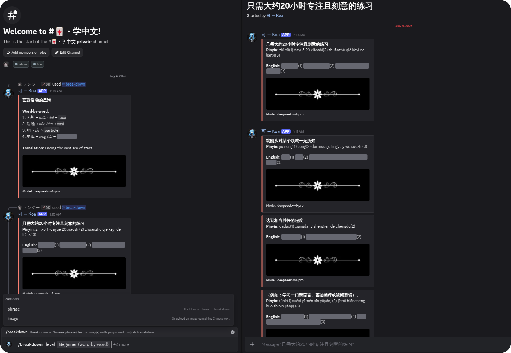

<div align="center">

# 可 — koa

**Chinese language breakdown Discord bot**  
Pinyin · English · Right in your server

[](https://python.org)
[](https://github.com/Rapptz/discord.py)
[](https://deepseek.com)
[](https://openai.com)
[](https://github.com/astral-sh/uv)
[]()

</div>

---

## Overview

**koa** breaks down any Chinese phrase into clause-by-clause cards with pinyin and English translation. It supports two modes:

- **Beginner** (default) — word-by-word breakdown. Each word shows `Chinese → pinyin → ||hidden English||`. Click the spoiler to reveal the meaning, try to remember it next time.
- **Advanced** — meaning-chunked spoilers. Pinyin is visible, English is hidden behind `||spoiler||(N)` with matching number links.

You can also upload an image containing Chinese text — koa transcribes it first (via OpenAI `gpt-4o-mini`), then breaks it down.

> Breakdowns powered by [DeepSeek](https://deepseek.com), transcription by [OpenAI](https://openai.com). No database, no bloat.



---

## Quick Start

```bash
git clone https://github.com/yourname/koa.git
cd koa
cp .env.example .env   # fill in your keys
just setup
just run
```

---

## Commands

| Command | Description |
|---------|-------------|
| `/breakdown <phrase>` | Text mode — break down a Chinese phrase |
| `/breakdown <image>` | Image mode — transcribe an image, then break it down |
| `!breakdown <phrase>` | Prefix command — text only, beginner mode |

**Parameters** (slash command):

| Parameter | Description |
|-----------|-------------|
| `phrase` | Chinese text to break down (optional) |
| `image` | Upload an image containing Chinese text (optional) |
| `level` | `Beginner` (word-by-word, default) or `Advanced` (chunked spoilers) |

At least one of `phrase` or `image` is required. Cooldown: 3 seconds per user.

---

## Project Structure

```
koa/
├── src/
│   ├── main.py          # Discord bot (commands, cooldown, permissions)
│   ├── breakdown.py     # DeepSeek breakdown + OpenAI transcription
│   ├── config.py        # .env settings
│   └── logger.py        # Structured logging
├── .env.example
├── pyproject.toml
└── justfile
```

---

## Environment Variables

| Variable | Required | Default | Description |
|----------|----------|---------|-------------|
| `DISCORD_TOKEN` | yes | — | Discord bot token |
| `DEEPSEEK_API_KEY` | yes | — | DeepSeek API key (breakdown) |
| `DEEPSEEK_MODEL` | no | `deepseek-chat` | Model for breakdown |
| `OPENAI_API_KEY` | no | — | OpenAI API key (image transcription) |
| `TRANSCRIPTION_MODEL` | no | `gpt-4o-mini` | Model for image transcription |
| `ALLOWED_USER_IDS` | no | — | Comma-separated user IDs (empty = anyone) |

---

## Tech

- **uv** — package manager
- **discord.py** — bot framework
- **openai** — API client (DeepSeek for breakdown, OpenAI for transcription)
- **just** — task runner

Licensed under [MIT](LICENSE).
